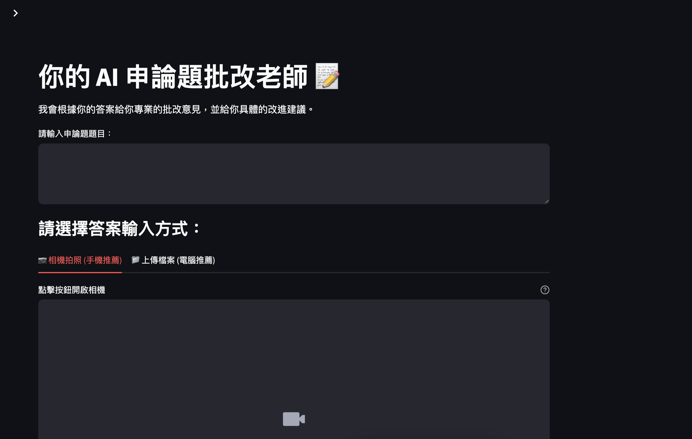

# AI Essay Grading Teacher 📝

[](https://www.python.org/downloads/)
[](https://streamlit.io)
[](https://opensource.org/licenses/MIT)

This is an intelligent essay grading application built with Streamlit, powered by the Google Gemini and Cloud Vision APIs. Users can submit essay answers through various methods, and the AI, acting as a professional law expert, will provide scores across five core dimensions, along with detailed feedback, improvement suggestions, and a revised sample answer.

**[➡️ streamlit link](https://essay-analyzer.streamlit.app/)**

---

## 📸 Application Screenshot

*(It is recommended to place a screenshot or a GIF of the application here to quickly demonstrate its functionality.)*



---

## ✨ Features

* **Multi-Modal Answer Input**: Supports submitting answers via:
    * **Manual Typing**: Directly type or paste answers into the text area.
    * **Camera Input**: Use a phone or computer camera to instantly capture and upload handwritten or printed answers.
    * **File Upload**: Supports uploading multiple image files (`.png`, `.jpg`, `.jpeg`) at once.
* **High-Speed OCR**: Integrates with **Google Cloud Vision API** for fast and accurate text recognition from images.
* **Image Pre-processing**: Utilizes the **Pillow** library to automatically resize and optimize images before OCR, improving recognition speed and efficiency.
* **Multi-Dimensional AI Scoring**: Employs the powerful **Google Gemini 1.5 Pro** model to score essays based on five professional dimensions:
    1.  Relevance to the Topic
    2.  Structure & Logic
    3.  Professional & Policy Comprehension
    4.  Critique & Specificity of Suggestions
    5.  Language & Expression
* **Real-Time Streaming Feedback**: AI-generated feedback is displayed character-by-character in a typewriter effect, enhancing the user's interactive experience.
* **Visualized Radar Chart Analysis**: Uses **Plotly** to create a radar chart of the scores, allowing users to easily visualize their strengths and weaknesses.
* **Cloud-Based History Persistence**: Integrates with **Firebase Firestore**, enabling registered users to securely save every grading record (question, answer, scores, feedback) to the cloud for easy access anytime.

---

## 🛠️ Technology Stack

* **Frontend**:
    * [Streamlit](https://streamlit.io/)
* **Backend & AI**:
    * **AI Grading Model**: Google Gemini 1.5 Pro (via `langchain-google-genai`)
    * **Optical Character Recognition (OCR)**: Google Cloud Vision API
    * **Image Processing**: Pillow
* **Database**:
    * Google Firebase Firestore
* **Charting**:
    * Plotly

---

## 📂 Project Structure

```
.
├── .streamlit/
│   └── secrets.toml        # Secret configuration for Streamlit Cloud deployment
├── main.py                 # Main Streamlit application script
├── requirements.txt        # Python dependency list
├── service-account-key.json # (For local development) Google Cloud Service Account key
└── README.md               # Project documentation
```

---

## 🚀 Installation & Setup

Follow these steps to set up and run the project in your local environment.

### 1. Prerequisites

* Python 3.11 or higher
* Git

### 2. Installation Steps

1.  **Clone the repository**
    ```bash
    git clone [URL_OF_YOUR_GITHUB_REPO]
    cd [YOUR_PROJECT_FOLDER_NAME]
    ```

2.  **Create and activate a virtual environment**
    ```bash
    # Create the virtual environment
    python -m venv venv

    # Activate on macOS/Linux
    source venv/bin/activate

    # Activate on Windows
    .\venv\Scripts\activate
    ```

3.  **Install dependencies**
    ```bash
    pip install -r requirements.txt
    ```

4.  **Configure Credentials (Crucial Step)**

    You need to configure your Google Cloud credentials. There are two scenarios:

    **Scenario A: Deploying on Streamlit Cloud**
    * Store all your keys (including `firebase_credentials` and `GOOGLE_API_KEY`) in the `.streamlit/secrets.toml` file. Streamlit will automatically read them upon deployment.

    **Scenario B: Running on a Local Machine**
    * **Gemini API Key**: Keep the `GOOGLE_API_KEY` in your `secrets.toml` file. Streamlit can still read this locally.
    * **Service Account Key**:
        a.  Copy the entire content of the `[firebase_credentials]` section from your `secrets.toml` file and save it as a new JSON file named `service-account-key.json` in your project's root directory.
        b.  **Before running the app**, set an environment variable in your terminal that points to this file:
        ```bash
        # On macOS / Linux
        export GOOGLE_APPLICATION_CREDENTIALS="service-account-key.json"

        # On Windows (Command Prompt)
        set GOOGLE_APPLICATION_CREDENTIALS="service-account-key.json"
        ```
        *This setting is only active for the current terminal session.*

### 5. Run the Application

After completing the setup, run the following command:
```bash
streamlit run main.py
```
The application should open automatically in your web browser.

---

## Future Work

* [ ] **Implement Robust Authentication**: Integrate a secure solution like `streamlit-firebase-auth` or other OAuth providers for true Google Account sign-in.
* [ ] **Architectural Refactoring**: Consider refactoring the project into a professional architecture with Next.js (Frontend) + FastAPI (Python Backend) for greater customization and scalability.
* [ ] **Enhanced Error Handling**: Provide more comprehensive error handling and user feedback for API calls and service interruptions.
* [ ] **Support for More Subjects**: Expand the AI prompt to handle essay questions from different academic fields.

---

## 🤝 Contributing

Contributions are welcome! Please feel free to improve this project.
1.  Fork the Project.
2.  Create your Feature Branch (`git checkout -b feature/AmazingFeature`).
3.  Commit your Changes (`git commit -m 'Add some AmazingFeature'`).
4.  Push to the Branch (`git push origin feature/AmazingFeature`).
5.  Open a Pull Request.

---

## 📄 License

This project is licensed under the MIT License. See the `LICENSE` file for details.
